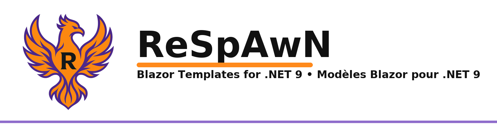

 



- Blazor templates (module + project) for .NET 9

---

### Templates included
- **r-bzr-project-sm**: multi-project Blazor project lightweight
- **r-bzr-project-l**: multi-project Blazor project full
- **r-bzr-module-sm**: multi-project Blazor module lightweight
- **r-bzr-module-l**: multi-project Blazor module full
- **r-blazor-auth-module**: multi-project Blazor module with authentication

### Install
```bash
dotnet new install ReSpAwN.Templates
```